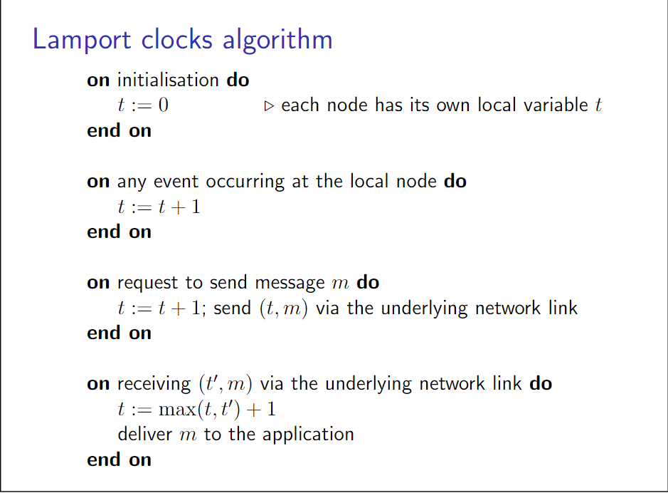

- 算法
	- 每一个节点维护一个初始化为0的整数时间戳$$t$$，在节点每遇到一个事件时增加$$t$$。节点之间通信需要在消息中附上$$t$$。特别地，接收节点将当前时间戳调整为$$max(t, t') + 1$$，其中$$t$$为接受节点时间戳，$$t'$$为消息附带的时间戳
	- {:height 558, :width 746}
- 性质
	- 排序
		- 即按照lamport timestamtp（一般为整数）大小进行排序
	- 如果事件$$a$$与$$b$$满足$$a\to b$$，则一定有$$L(a) < L(b)$$，反之不成立
	- 全序
		- 给分布式系统中的每一个节点赋一个序号值，用$$N(e)$$表示事件$$e$$所在节点的序号
		- $$a\prec b \Leftrightarrow L(a) < L(b) \lor (L(a) = L(b) \land N(a) < N(b))  $$
-