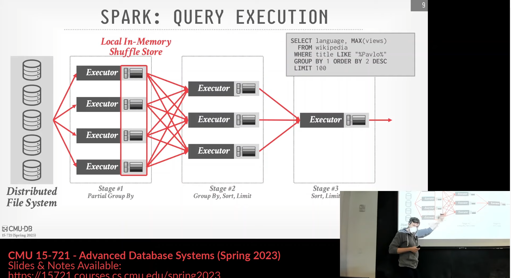

- 背景
	- 用c++编写的单线程sql执行引擎，嵌入到DataBricks Runtime
	- Spark运行模型
		- 
- 设计
	- pull-based
	- vectorized & precompiled primitives
		- 使用模板写了大量的特化版本，在运行时会根据batch（一次的输入）的数据特点（是否有NULL列？是否需要使用position list进行定位？）来选择特化的执行路径，可以提升性能
		- 为什么不用code gen?
			- code gen非常难debug，论文中提到使用code gen开发的原型需要花大量时间维护可观测性工具链而不是执行引擎本身
			- 相比之下vectorized非常好debug，毕竟它们本质上就是c++代码，而且使用了precompiled primitives，经过大量的工程迭代也可以获得比肩JIT的性能
			- andy在课上举了Hyper中的Operator fusion与Vectorwise中的Precompiled primitives对比。两者经过工程优化可以获得几乎一样的性能，但是前者无法很好地维护诸如查询时间等信息，对用户不友好
	- query processing model
		- (column batch -> column vector) + position list
			- 比较经典的设计，使用position list给出需要处理的column的偏移量
			- 
			- 论文中发现active rows在实际使用中性能不如使用position list
	- memory management
		-