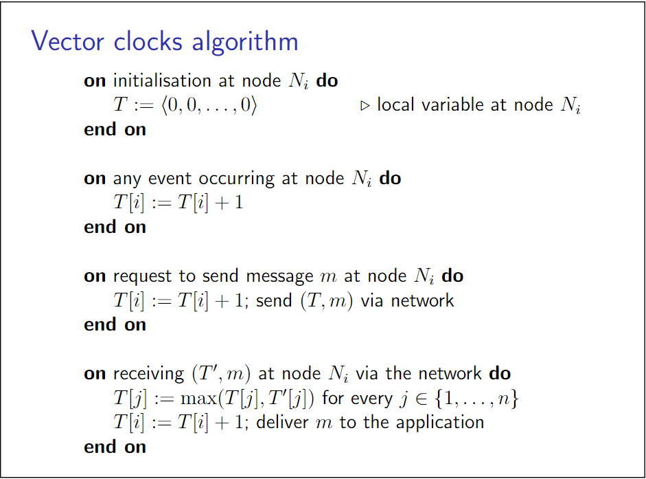

- 算法
	- vector clock假设事先知道系统中节点的总数$$n$$，每一个节点维护一个保存了所有节点时间戳的$$n$$维向量$$<t_1, t_2, \cdots, t_n>$$。对于$$i$$下标的时间戳可以通过$$T[i]$$访问
	- 节点$$i$$在每一次事件后自增$$T[i]$$。与lamport timestamp类似地，节点发送消息附上当前的vector clock，接受节点将合并接受到的vector clock与本地的vector clock。合并过程中，本地的vector clock的每一个下标都被更新为两个vector clock对应下标中的较大者，最后自增当前节点对应下标项
	- lamport timestamp可以看做vector clock的一种退化
	- 
- 性质
	- 排序
		- 可以看做$$n$$维数组的排序
		- 特别地，如果两个vector timestamp之间不可比较，则称两者并发
	- 有
		- $$V(a) < V(b) \Leftrightarrow a \to b$$
		- $$V(a) = V(b) \Leftrightarrow a = b$$
		- $$V(a) \parallel V(b) \Leftrightarrow a \parallel b$$