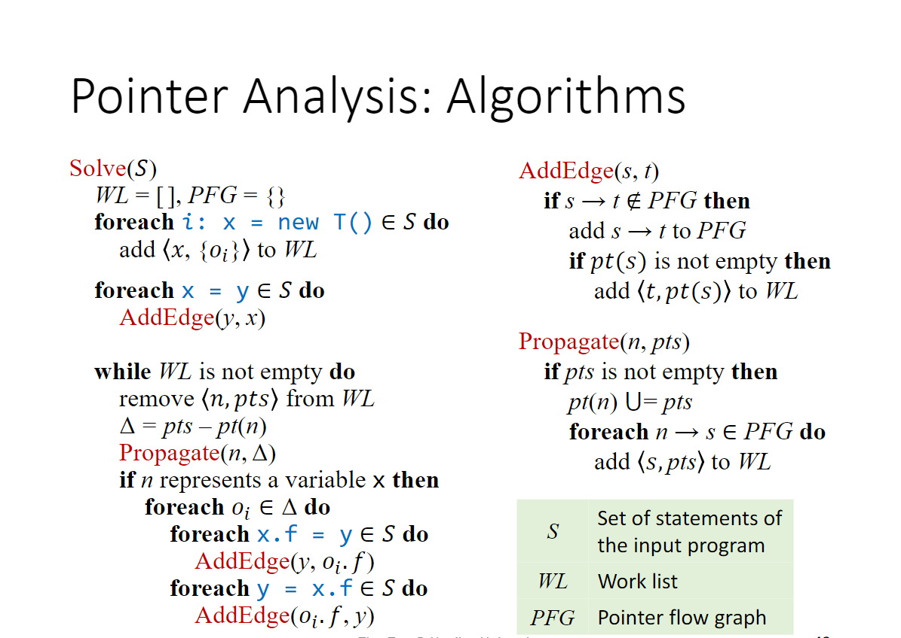
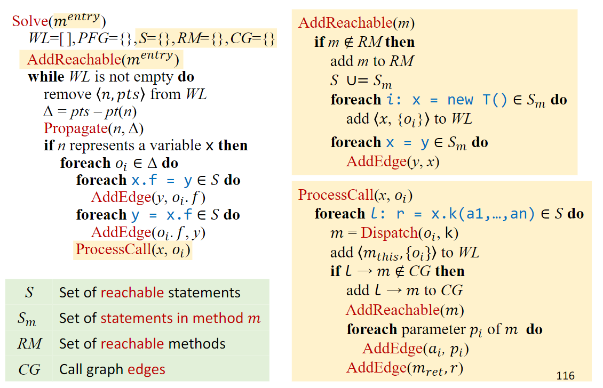

- 算法
	- 不考虑method call
		- 伪代码
			- 
		- 解释
			- `Solve`首先遍历所有的创建对象语句（$x = new A()$）以及简单赋值语句（$x = y$），并生成相应的对象，在PFG中添加相应的边。`Solve`中的主循环用于计算闭包，传递$<pointer, points-to-set>$来更新PFG以及pointer的points-to-set，同时处理域相关语句（$x.f = y, y = x.f$）
			- `AddEdge`中判断当前边是否已经在PFG中存在，如果不存在则加入。加入边之后将源点的points-to-set加入目标点的points-to-set中
			- `Propagate`将$pts$中的所有对象加入当前pointer的points-to-set中，并更新PFG中所有后继的points-to-set
	- 考虑method call
		- 伪代码
			- 
		- 解释
			- 对于每一个method，都要进行一遍`Solve`开头的初始化
			- 在`Solve`更新传递闭包过程中，需要额外处理函数调用
			- `ProcessCall`通过对象类型解析方法，更新callgraph（ [[Call Graph Construction]] ）以及PFG
-