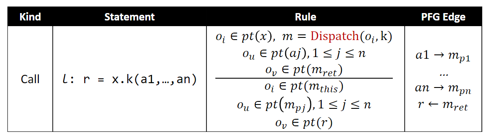

- 只考虑可能影响指针分析的语句，即创建对象、赋值以及Method call语句
- 需要考虑每一条规则如何影响PFG以及pointer的points-to-set
- $x = new\ A()$
- $x = y$
- $x.f = y$
- $y = x.f$
- $r = x.m(a, b)$
	- 上下文不敏感
		- 
		- 为什么不建立边$x\to m_{this}$
			- $x$可能包含可以dispatch出其他方法的对象，上图中的规则保证只有能够dispatch到m的对象会流入到$m_{this}$中