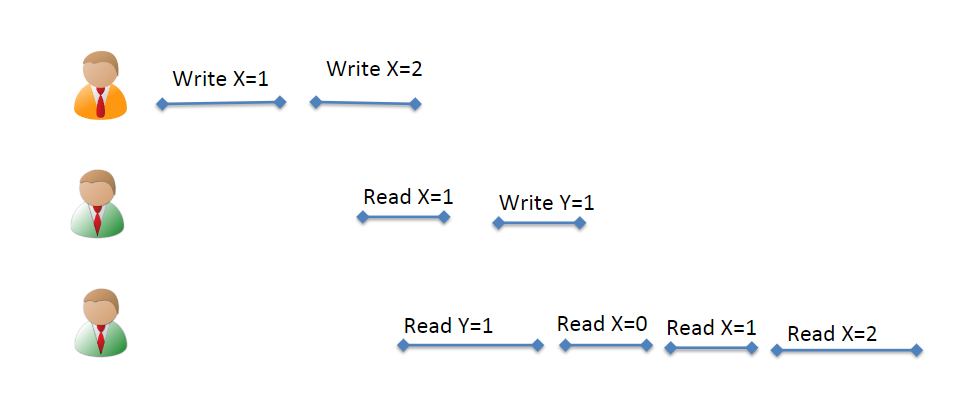

- 为了统一术语，下文中的所有节点=线程=进程，即我们可以认为这是一个多节点的分布式系统或者一个多线（进）程程序
- strict consistency
	- 所有操作都有一个**完全一致的全局时间戳**，并且每一个写操作**立刻对所有节点可见**
	- 实际分布式系统中无法实现
- [[基于主从架构的协议]]
- linearizability
	- 在sequential consistency基础上，维护两个时间之间的completion-to-issue顺序。即，如果一个操作的结束时间早于另一个操作的开始时间，那么前者一定发生在后者之前
	- 一般的分布式系统要求的最强一致性
- sequential consistency
	- 要求
		- 所有节点看到的操作执行顺序一致，有**全序**，单个节点上的操作顺序（实际上也就是写）在全序中必须保持一致
	- {:height 321, :width 746}违反了SC，因为R(X,1)发生在W(Y,1)之前，故而其他节点如果R(Y,1)，必然不会读取到X有比1更旧的值
	-
- causal consistency
	- 同一个节点上的多个写之间顺序固定（即具有因果关系），没有全序
	- 不同线程看到的具有因果关系的写顺序必须固定，其他并发的写顺序任意
	- sequential consistency蕴含casual consistency
		- 因为per-node issue-completion order保证了具有因果关系的写顺序固定，并且sequential consistency的第二条性质保证其他节点看到的写操作序列一致
- FIFO consistency
	- 仅需要保证每一个节点上的program order，没有全序
	- 非常弱的一致性
- 参考：
	- [常见一致性的实现（涉及多播算法，暂时不深究）](https://netium.gitlab.io/2019/10/30/%E5%88%86%E5%B8%83%E5%BC%8F%E7%B3%BB%E7%BB%9F%E7%9A%84%E4%B8%80%E8%87%B4%E6%80%A7%E6%A8%A1%E5%9E%8B/)
	- [面向服务器一致性模型的总结](https://mr-dai.github.io/consistency-models/)
-